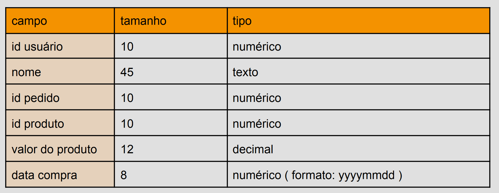
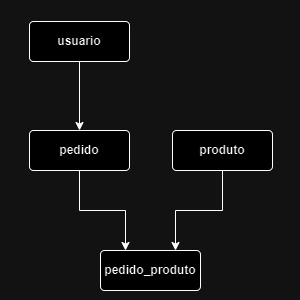
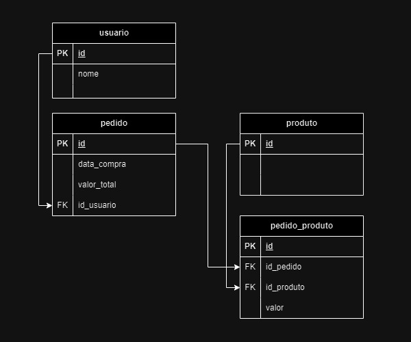
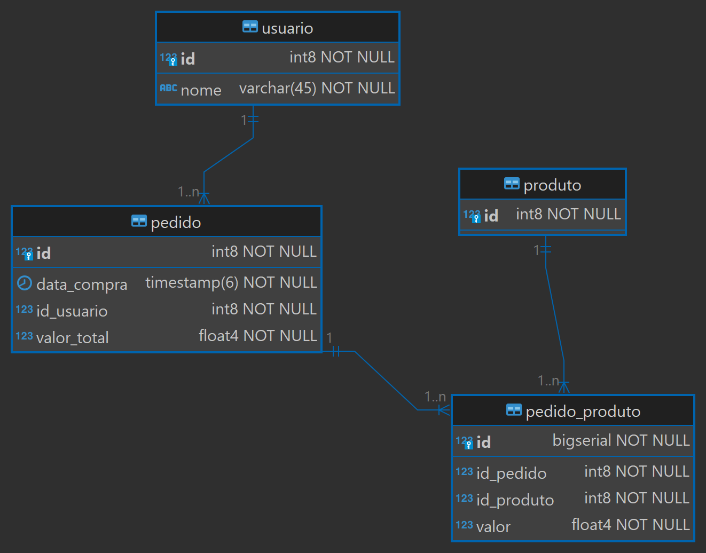
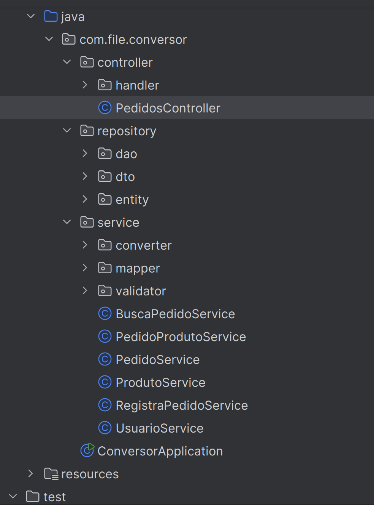

# Gerenciamento de pedidos API

Este projeto visa aprofundar o entendimento dos conceitos de API REST por meio da implementação em Java Spring Boot utlilzando consumo e processamento de arquivos de texto.

## Índice

- [Contexto](#contexto)
    - [Entrada de dados](#entrada-de-dados)
    - [Saída de dados](#saída-de-dados)
- [Tecnologias](#tecnologias)
- [Solução](#solução)
    - [Modelagem conceitual](#modelagem-conceitual)
    - [Modelagem lógica](#modelagem-lógica)
    - [Modelagem física](#modelagem-física)
- [Arquitetura](#arquitetura)
- [Testes](#testes)
- [Uso](#uso)

# Contexto

Foi definido um cenário de negócio ficticio para que possamos trabalhar em uma solução.  
Suponha que temos uma demanda para integrar dois sistemas.  
O sistema legado que possui um arquivo de pedidos desnormalizado e precisamos transformá-lo em um arquivo json normalizado.

## Entrada de dados

O arquivo do sistema legado possui uma estrutura em que cada linha representa uma parte de um
pedido. Os dados estão padronizados por tamanho de seus valores, respeitando a seguinte tabela:



Exemplo (primeira linha não consta no arquivo):

```
|-userId--|--------------userName----------------------|-orderId-|-prodId--|---value---|-date--|
0000000002                                     Medeiros00000123450000000111      256.2420201201
0000000001                                      Zarelli00000001230000000111      512.2420211201
0000000001                                      Zarelli00000001230000000122      512.2420211201
0000000002                                     Medeiros00000123450000000122      256.2420201201
```
Segue dois arquivos de exemplos que podem ser utilizados para entrada de dados:

* [dados_1.txt](assets/arquivos/data_1.txt)  
* [dado_2.txt](assets/arquivos/data_2.txt)

## Saída de dados

Considere como estrutura base do payload de response o seguinte JSON:

````json
[
    {
        "user_id": 1,
        "name": "Zarelli",
        "orders": [
            {
                "order_id": 123,
                "total": "1024.48",
                "date": "2021-12-01",
                "products": [
                    {
                        "product_id": 111,
                        "value": "512.24"
                    },
                    {
                        "product_id": 122,
                        "value": "512.24"
                    }
                ]
            }
        ]
    },
    {
        "user_id": 2,
        "name": "Medeiros",
        "orders": [
            {
                "order_id": 12345,
                "total": "512.48",
                "date": "2020-12-01",
                "products": [
                    {
                        "product_id": 111,
                        "value": "256.24"
                    },
                    {
                        "product_id": 122,
                        "value": "256.24"
                    }
                ]
            }
        ]
    }
]
````

O projeto considerou a consulta geral de pedidos e, também, a inclusão dos seguintes filtros:

* id do pedido
* intervalo de data de compra (data início e data fim)
* utilização de paginação durante a exibição do resultados (página e quantidade de registros)

## Tecnologias

Tecnologias aplicadas no desenvolvimento do projeto:
* Java Spring Boot (Maven) 
    * Lombok (abstração dos getters e setters e construção de builders)  
    * JPA e Hibernate  
* PostgreSQL (Docker)

A solução proposta define o uso de um banco de dados relacional devido a sua capacidade de indexação e validação dos dados processados pela lógica, otimizando a performance durante a implementação dos filtros e garantindo um ponto de acesso para validações de dados.

## Solução

Foi implementada uma API com dois endpoints:
* POST para fazer o upload um arquivo de texto e gravar os registros no banco de dados
* GET para buscar os registros que foram armazenados no banco de dados e retorná-los em um JSON.
 
Para mais detalhes sobre os endpoints, acesse as especificações do [Swagger](docs/swagger-code-doc/orders-management-swagger-code.yaml)

Segue um detalhamento sobre a modelagem de dados aplicada no projeto:

### Modelagem conceitual



### Modelagem lógica



### Modelagem física




## Arquitetura

O projeto foi desenvolvido utilizando uma arquitetura de camadas para separar as regras de negócio do tratamento de dados.

Pacotes:

* `controller`: Controladores de api
* `repository`: Tratamento de dados
* `service`: Regras de negócio e validações




## Testes

Além dos testes unitários, foram projetados cenários de testes para explorar os retornos de sucesso e erros esperados para ambos os endpoints (POST e GET). Para mais detalhes sobre o planejamento, acesse a planilha [casos de testes](docs/test-cases/casos-teste-post-get.xlsx).  

A partir desse documento, utilizando o Postman foi criada essa [collection](docs/test-cases/Orders%20Management%20API.postman_collection.json) para realização dos testes manuais. Onde, o usuário poderá ter acesso detalhado a diversos tipos de request e seus respectivos responses.

** Observação **

Para testar diversos retornos de "erros esperados" do endpoint POST, foi necessário realizar algumas manipulações de dados. Para isso, diversos arquivos foram criados e estão disponiveis em `docs/test-cases/post-teste-arquivos/expected-errors-files`


## Uso

Foi gerado um docker-compose para o servico do postgres e um dockerfile para a aplicação java, sendo assim, para subir o projeto, basta executar `docker-compose up` em um local onde tem a docker instalada e o projeto já estará pronto para uso.